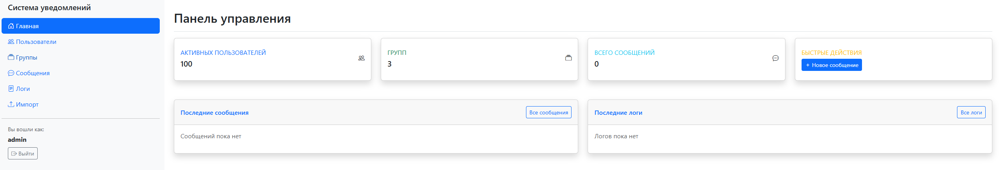

## Описание

Приложение позволяет отправлять уведомления пользователям через Email, SMS и Telegram с поддержкой резервных способов доставки.

### Основные возможности:
- Управление пользователями и группами через веб-интерфейс
- Отправка уведомлений с резервными способами доставки
- Детальное логирование всех отправок
- Импорт пользователей
- Массовые операции над пользователями
- Админ-панель
- Безопасность

## 1. Примеры работы




## 2. Настройка

### Настройка конфигурации
1. Установить зависимости из requirements.txt
2. Скопируйте файл примера конфигурации:
```bash
copy config.example.py config.py
```

3. Отредактируйте `config.py` и настройте необходимые параметры.


## 3. Настройка внешних сервисов

### Email (Gmail)


В `config.py`:
   ```python
   EMAIL_HOST_USER = 'your-email@gmail.com'
   EMAIL_HOST_PASSWORD = 'your-app-password'
   ```

### SMS (SMS.ru)

В `config.py`:
   ```python
   SMS_API_KEY = 'your-api-key'
   ```

### Telegram

В `config.py`:
   ```python
   TELEGRAM_BOT_TOKEN = 'your-bot-token'
   ```

## 4. Запуск приложения

### Разработка
```bash
python manage.py runserver
```

Приложение будет доступно по адресу: http://127.0.0.1:8000/


### Админ-панель

Доступна по адресу: http://127.0.0.1:8000/admin/
- **Логин:** admin
- **Пароль:** admin123

### Логи приложения
- Путь: `logs/django.log`
- Содержит: системные события, ошибки

### Логи отправки уведомлений
- Путь: `logs/notification_log_YYYYMMDD_HHMMSS.json`
- Создается при каждой отправке
- Содержит детальную информацию о доставке каждому пользователю
